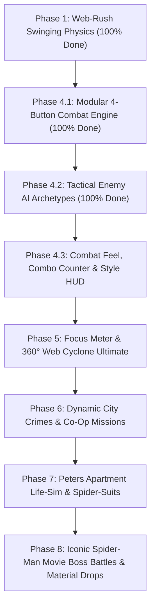

# 🕸️ Spider-Man: Web of Destiny — Master Game Workflow & Roadmap

> **Core Vision:** A fast-paced, physics-driven Spider-Man sandbox combining seamless **Web Rush swinging**, **GTA-style interactive combat & web-pulling**, **Peter Parker apartment life-sim**, and **co-op Spider-Verse multiplayer**.

---

## 🌆 Game Concept & Lore: The Spider-Verse Solution
**Why are there multiple Spider-Men?**
* **The Spider-Society / Multiverse Convergence:** Players are Spider-Heroes across different dimensions (Classic Peter, Miles, Spider-Gwen, 2099, Noir, or Custom Avatars).
* **Multiplayer Crime System (Fixing the "Catching Criminals" Problem):**
  1. **Distributed City Crimes:** Crimes spawn dynamically across different city districts (Downtown Bank Heist, Harlem Mugging, Queens Rooftop Thugs), so players aren't crowded in one spot.
  2. **Co-Op Scaled Events:** If 2–4 Spider-Heroes arrive at the same crime scene, the wave dynamically spawns more criminals / brute mini-bosses so everyone gets in on the action and shares XP/Cash rewards.
  3. **Spider-Scanner (Personal Dispatch):** Players can tune into the police scanner at Peter's apartment or on rooftops to take on solo crime missions or team up with friends.

---

## 📋 Master Phase-by-Phase Roadmap

---

### 🟢 Phase 1: Fluid Web-Swinging Mechanics (✅ 100% COMPLETE)
* [x] **1.1 Smart Building Anchor System (Proximity Street Auto-Targeting)**
  * Auto Building Raycast with object-space Left/Right hand anchor matching (120 studs).
* [x] **1.2 Ground Double-Web Slingshot Launch (Zero Floor Drag)**
  * Ground launch fires dual web beams, rocketing the player upward into the air anywhere.
* [x] **1.3 Tangential Momentum & Street Corridor Pendulum Physics**
  * True trigonometric pendulum arc curve ($\sin\theta$) accelerating up to +90 studs/s with `WASD` banking.
* [x] **1.4 Dynamic 70° Apex Auto-Release & High-Speed Launch**
  * Auto-releases cleanly at 70° climb apex into a high-speed forward glide (115–185 studs/s).
* [x] **1.5 🕷️ Spider-Man Wall-Run & Wall-Crawl System**
  * Automatic vertical building wall-sprint and wall-jump off facades.
* [x] **1.6 Server Visual Replication & Dynamic FOV Rush**

---

### 🟢 Phase 4.1: Streamlined 4-Button Combat Kit & Architecture (✅ 100% COMPLETE)
* [x] **Modular Architecture Refactoring:**
  * Clean decoupled client modules: `CombatMelee.luau`, `CombatWebs.luau`, `CombatDodge.luau`, `CombatVFXListener.luau`, and `CombatController.client.luau` (~135 lines).
* [x] **Universal Strike & Ground Slam (`L-Click`):**
  * Ground: 1-2-3 Kinetic Punch Combo (tight 5.8-stud hitbox, rhythmic 0.26s cadence).
  * In-Air: 22-stud Web Ground Slam shockwave.
* [x] **Web-Strike Zip Kick (`R` Key):**
  * 65-stud crosshair lock-on zip dropkick at 120 studs/s with anti-clipping positioning lock.
* [x] **Contextual Smart Web Gadget (`E` Key):**
  * Target Armed $\rightarrow$ Web-Yank Disarm & Weapon Orbit Throw (`26 DMG`).
  * Target Unarmed $\rightarrow$ Rapid Web-Pellets $\rightarrow$ Cocoon & 8-stud Wall-Pin.
* [x] **Spider-Sense Acrobatic Dodge (`F` Key):**
  * Straight 8.8-stud flat retreat slide with frame-locked forward orientation + point-blank face-web counter.
* [x] **HUD Clean-Up:**
  * Zero screen text clutter, silent background targeting engine with Aim-Priority & Threat Weighting.

---

### 🟢 Phase 4.2: Tactical Enemy Archetypes & AI Behaviors (✅ 100% COMPLETE)
* [x] **4.2.1 🔫 Armed Gunner / Rooftop Sniper (Ranged Threat)**
  * Keeps distance (25–45 studs), aims with a thin red laser telegraph line (0.9s charge).
  * Firing deals sharp damage and interrupts player combos.
  * **Counter:** Press **`E` (Smart Web Gadget)** from afar to snatch their gun and smash them with it!
* [x] **4.2.2 🛡️ Heavy Armored Brute (Defensive Threat)**
  * Sturdy build (160 HP), raises guard stance to block and parry straight frontal punches with metallic sparks.
  * Heavy telegraphed club swing that demands a dodge.
  * **Counter:** Press **`E`** to cocoon his guard in webs, or **`R` (Web-Strike Zip Kick)** to break his stance!
* [x] **4.2.3 🦹 Street Brawler Mob (Swarm Threat)**
  * Basic melee grunts (80 HP) that coordinate dynamic circular surround/flank positioning and rhythmic swarms.
  * **Counter:** Stagger with 1-2-3 punch combos, Spider-Sense dodge (`F`), and in-air Ground Slams (`Air L-Click`).

---

### 🟠 Phase 4.3: Visceral Combat Feel, Hit-Stop & Style HUD
* [ ] **4.3.1 Dynamic Hit-Stop (Micro-Freeze Impact Frames)**
  * 2-frame tactile micro-pause (`0.035s`) on heavy finishers (Punch 3, Web-Strike, Ground Slam, Disarm Impact).
* [ ] **4.3.2 Combo Multiplier & Style Meter HUD**
  * Sleek right-hand arcade combo counter (`12x COMBO!`) with stylish rank ratings:
    * `D (Decent)` $\rightarrow$ `C (Cool)` $\rightarrow$ `B (Brutal)` $\rightarrow$ `A (Amazing)` $\rightarrow$ `S (Spectacular)` $\rightarrow$ `SPIDER-TIER!`
* [ ] **4.3.3 Directional Spider-Sense Halo Cue**
  * Subtle comic-book red/white squiggle particles over Spider-Man's head before an enemy strikes.

---

### 🟣 Phase 5: Focus Meter & 360° Web Cyclone Ultimate
* [ ] **5.1 Focus Bar System**
  * Fills up by landing combos and executing perfect dodges.
* [ ] **5.2 🌪️ 360° Web Cyclone / Web Tornado Finisher (`T` Key)**
  * When Focus is 100%, press `T` to grab a webbed enemy by the ankles, spin them around in a 360° tornado clearing all nearby thugs, and hurl them into a building wall!
* [ ] **5.3 Focus Quick-Heal Option (`H` Key)**
  * Spend 50% Focus to patch up health mid-combat.

---

### 🔵 Phase 6: Dynamic City Crime Generation & Co-Op Events
* [ ] **6.1 Procedural City Crime Spawner**
  * Bank Heist in progress, Alleyway Mugging, Rooftop Arms Deal, Car Chase getaway.
* [ ] **6.2 Police Radio Scanner**
  * Real-time audio/text dispatch alerts guiding players to active crimes.
* [ ] **6.3 Co-Op Scaled Waves & Shared XP / Hero Cash Rewards**

---

### 🟤 Phase 7: Peter Parker's Apartment Life-Sim & Spider-Verse Suits
* [ ] **7.1 Peter Parker's Apartment Interior**
  * Living room / bedroom with rest spots, workbench, and window dive exit into city web-swinging.
* [ ] **7.2 Spider-Verse Wardrobe & Suit Perks**
  * Classic Suit, Miles Morales (Bio-Electricity), Symbiote Black Suit (Tendril Rage), Spider-Man 2099 (After-Image Dash), Noir (Stealth).
* [ ] **7.3 Workbench Crafting & Gadget Upgrades**
  * Use dropped villain materials to forge new web formula upgrades, suit mods, and custom gadgets.

---

### 🔴 Phase 8: Iconic Spider-Man Movie Boss Battles & Material Drops
* [ ] **8.1 🐙 Doctor Octopus (Doc Ock) Rooftop Boss Encounter**
  * 4 articulating mechanical tentacles (25-stud sweep reach, rooftop climbing, vehicle/generator hurling).
  * Phase 2 Overdrive: High-speed tentacle flurry and ground shockwaves.
  * **Counter:** Web-pin tentacles to ground with **`E` (Web-Pellets)**, then **`R` (Web-Strike)** into Ock's chest!
  * **Boss Drops:** *Octavius Nanotech Cores*, *Hydraulic Actuator Relays*.
* [ ] **8.2 🦎 The Lizard (Dr. Curt Connors) Sewer/Street Ambush Encounter**
  * Brutal predatory strength: high-speed wall lunges, heavy tail-whip AoE shockwave, and regenerative healing.
  * **Counter:** Rapid punch staggering combos (`L-Click`) and dense web-cocooning (`E`) to halt regeneration.
  * **Boss Drops:** *Reptilian Bio-Vials*, *Regenerative Scale Plates*.
* [ ] **8.3 🎃 Green Goblin (Norman Osborn) Aerial Glider Dogfight Encounter**
  * High-velocity glider strafing runs, pumpkin bomb cluster bombardments, and razor-bat swarms.
  * **Counter:** In-Air Ground Slam (`Air L-Click`) onto glider, snatch pumpkin bombs mid-air and hurl them back (`E`).
  * **Boss Drops:** *Goblin Glider Micro-Turbines*, *Oscorp Nitro Compounds*.
* [ ] **8.4 💎 Boss Material Drop & Physical Loot Pickup Engine**
  * Dynamic physical material token spawns on boss defeat with magnetic suction pickup into player inventory.