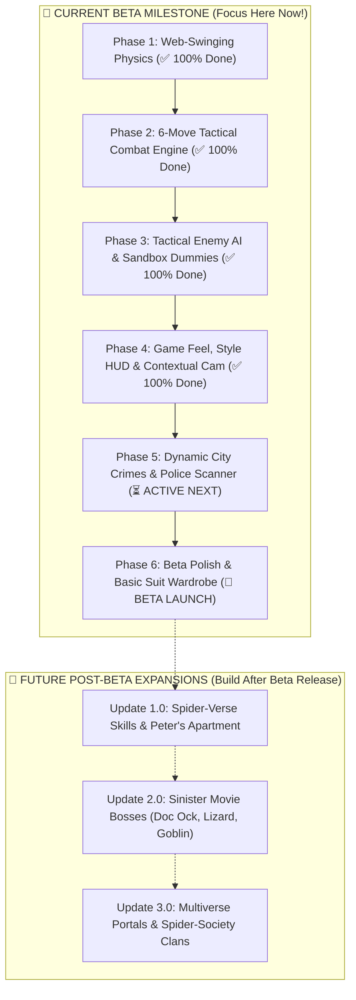

# 🕸️ Spider-Man: Web of Destiny — Master Development Workflow

> **Vision:** A fast-paced, physics-driven Spider-Man sandbox combining seamless **Web-Swinging traversal**, **tactile action combat**, and **co-op Spider-Verse gameplay**.

---

## 👥 Clear Division of Roles

* **🔨 Creator (You):**
  * **3D World & City Building:** Constructing the city, skyscrapers, streets, alleys, and landmarks in Roblox Studio.
  * **3D Models & Interior Props:** Peter's apartment furniture, water towers, billboards, and weapon models.
  * **Custom Art & Media Assets:** Custom character animations (R6/R15), sound audio IDs, and custom UI badges.
* **🤖 AI Coding Assistant:**
  * **Code & Systems Architecture:** Writing the Luau scripts, physics engines, procedural spawner algorithms, server networking/anti-cheat, combat mechanics, enemy AI behavior trees, and UI scripting that automatically adapt to your 3D world!

---

## 🗺️ Master Release Roadmap (Non-Overwhelming Overview)

---

# 🚀 PART 1: THE CURRENT BETA LAUNCH (Playable Public Release)

Everything needed to launch a complete, highly replayable, viral **Public Beta** on Roblox!

### ✅ 1. Fluid Web-Swinging & Traversal Engine (100% COMPLETED)
- [x] **Smart Building Anchor Detection:** 120-stud street proximity auto-targeting with left/right hand matching.
- [x] **Double-Web Slingshot Launch:** Ground launch catapulting the player into the sky from anywhere.
- [x] **Tangential Pendulum Physics:** True $\sin\theta$ gravity swoop accelerating up to 185 studs/s with `WASD` banking.
- [x] **Floaty 68° Apex Auto-Release:** Automatic smooth release into high-speed aerodynamic gliding.
- [ ] **🪂 1.7 Dynamic In-Air Aerodynamics & Skydiving State Machine:**
  * **State A: High-Altitude Skyscraper Leap (Spread-Eagle & Air Drag):**
    * When leaping off a building into open air, Spider-Man naturally assumes a spread-eagle skydiving pose.
    * Air resistance limits downward terminal velocity (~110 studs/s) with gentle forward gliding lift and subtle wind rush audio.
  * **State B: Steep Bullet Dive-Bomb (`Left-Shift` or Falling Velocity $> 85$ studs/s for $> 0.5$s):**
    * Tucks limbs into a steep head-first bullet dive bomb plunging at **165+ studs/s**!
    * Dynamic roaring wind audio + speed line particles + camera tightens for high-speed intensity.
  * **State C: Gravitational Kinetic Swing Transfer:**
    * Latching a web swing out of a dive bomb or freefall converts raw vertical gravity into an explosive, slingshot-level forward pendulum launch!
  * **State D: Low-Altitude Street Web-Save & Parkour Landing Roll:**
    * Approaching the pavement at high falling speeds automatically performs a last-second low-altitude web swoop or smooth forward parkour landing roll without splatting.

### ✅ 2. 6-Move Tactical Combat Engine (100% COMPLETED)
- [x] **`Left-Click` (Melee Combo & Air Slam):** 1-2-3 Kinetic Punch Combo (ground) / 24-stud AoE Ground Slam Shockwave (in-air).
- [x] **`Hold Left-Click` (Uppercut Launcher):** Skyward launcher with air juggle float.
- [x] **`E Key` (Smart Web Gadget):** Rapid Web-Pellets & Wall-Pinning / Gunner Weapon Disarm & Spiral Throw.
- [x] **`R Key` (Web-Strike Zip Kick):** 65-stud crosshair lock-on zip dropkick at 120 studs/s.
- [x] **`F Key` (Spider-Sense Dodge):** 0.45s invulnerability frames + point-blank face-web counter.
- [x] **`T Key` (360° Web Cyclone Blender):** Continuous 10-hit AoE DPS blender + 135 studs/s centrifugal wall slam.
- [x] **`H Key` (Quick-Heal):** Instant +35 HP recharge with real-time ability cooldown hotbar tray.

### ✅ 3. Tactical Enemy Archetypes & Training Dojo (100% COMPLETED)
- [x] **Armed Gunner / Rooftop Sniper:** Laser aim telegraph, long-range fire, disarmable with `E`.
- [x] **Heavy Armored Brute:** Sturdy build (160 HP), raises guard to block frontal attacks, breakable with `R` or `E`.
- [x] **Street Brawler Mob:** Basic melee grunts (80 HP) with surround/flank coordination.
- [x] **Training Dojo Sandbox:** `Dummy_Static`, `Dummy_Attacking`, and `Dummy_Infinite` (99,999 HP).
- [x] **Clean Depth-Sorted Overhead Health Bars:** Compact billboard design with 45-stud proximity limits (zero screen clutter).

### ✅ 4. Game Feel, Style HUD & Contextual Camera (100% COMPLETED)
- [x] **Contextual Smart Camera:** 100% Free Camera for traversal/swinging $\rightarrow$ seamless Shift-Lock for combat brawling.
- [x] **Zero Micro-Stutter Pivot:** Pure vertical eye-level pivot with dynamic speed FOV (70 to 82 FOV).
- [x] **Hit-Stop Impact Frames:** 2-frame tactile micro-pause (`0.042s`) on heavy finishers.
- [x] **Arcade Style Meter:** Dynamic combo rank scaling (`D` $\rightarrow$ `C` $\rightarrow$ `B` $\rightarrow$ `A` $\rightarrow$ `S` $\rightarrow$ `SPIDER-TIER!`).

---

### ✅ 5. Dynamic City Crimes & Police Scanner (100% COMPLETED)
* [x] **5.1 Procedural Random City Crimes (`CrimeService.server.luau`):**
  * **Bank Heist (Downtown):** 2 Gunners + 1 Armored Brute + 2 Brawlers raiding a bank entrance.
  * **Rooftop Arms Deal (High-Rise):** 2 Snipers on water towers + 1 Brute with throwable military crates (`E`).
  * **Alleyway Mugging (Street Level):** Innocent civilian cowering surrounded by 3 fast Brawlers.
  * **High-Speed Getaway Van (Street Chase):** Speeding armored van. Spider-Man can web-zip (`R`), disable engine (`E`), and stop the getaway!
* [x] **5.2 Police Radio Scanner & 3D Waypoint Beacons (`PoliceRadioHUD.luau`):**
  * Sleek NYPD dispatch notification banner: *"10-31 in progress at First National Bank..."*
  * 3D holographic waypoint beacon showing crime icon and distance (`🚨 BANK HEIST • 140m`) with off-screen edge clamping.
* [x] **5.3 Co-Op Scaled Waves & Hero Cash / XP Rewards:**
  * Scales enemy reinforcements if multiple Spider-Heroes join the fight ($\le 120\text{ studs}$).
  * Victory screen: `🎉 CRIME STOPPED! +150 XP | +$250 HERO CASH`.

---

### 🎨 6. Creator Asset & Polish Hub (Animations, VFX, SFX & Custom UI)
*(Creator's custom asset checklist — paste your custom Roblox Asset IDs & Models right into the Config files!)*

* **🎬 Custom Character Animations (R6 / R15):**
  * [ ] Web Swing Hang, Apex Apex Launch & Aerial Flips
  * [ ] Skydiving Spread-Eagle Pose & Steep Bullet Dive-Bomb Pose
  * [ ] 1-2-3 Kinetic Punch Combo & Uppercut Launcher
  * [ ] 65-Stud Web-Strike Zip Dropkick
  * [ ] Spider-Sense Perfect Dodge Retreat Slide & Counter
  * [ ] 360° Web Cyclone Spin Loop & Centrifugal Launch
* **🎵 Custom SFX Sound Suite (Paste Asset IDs in `GrappleConfig` & `CombatConfig`):**
  * [ ] Web-Shoot / Web-Thwip Sound ID
  * [ ] Melee Punch Impact Thuds & Heavy Finishers
  * [ ] Wind Rush Whoosh Loop (High-Speed Swings & Dive-Bombs)
  * [ ] NYPD Police Radio Squelch & Dispatch Sirens
  * [ ] Gunner Laser Charge & Sniper Fire
  * [ ] Brute Metallic Shield Block Clang
* **✨ Custom Visual FX (VFX & Particles):**
  * [ ] Custom Web Silk Beams & Wall-Pin Cocoons
  * [ ] Comic-Book Kinetic Hit Sparks
  * [ ] Bio-Electric Sparks (Spider-Sense & Miles Venom)
  * [ ] High-Speed Screen Speed Lines
* **🖼️ Custom UI Artwork & Badges:**
  * [ ] Custom Style Rank Badges (`D` $\rightarrow$ `SPIDER-TIER!`)
  * [ ] Custom Police Scanner HUD Banner & Ability Tray Icons
  * [ ] Custom 3D Spider-Compass Waypoint Reticles

---

### 🎯 7. Beta Launch & Public Release (BETA MILESTONE)
* [ ] **7.1 NYC City Environment & Props:**
  * High-rise skyscrapers, glass facades, Times Square animated billboard screens, street lampposts, water towers, and alley dumpsters.
* [ ] **7.2 Basic Suit Wardrobe Selector & Stats:**
  * Quick UI to switch between **Classic Suit**, **Miles Morales**, and **Symbiote Black Suit**.
  * Display Player Level, Hero Cash, and Total Crimes Stopped.
* [ ] **7.3 Public Beta Release:**
  * Ready for Roblox public playtesting, YouTube devlogs, and viral TikTok showcase clips!

---

# 🌟 PART 2: FUTURE POST-BETA EXPANSIONS (Future Updates)

*Do NOT worry about these right now—these are scheduled for major content updates after the Beta is live!*

---

### ⚡ Update 1.0: "Across the Spider-Verse & Peter's Apartment"
* **🏠 Peter Parker's NYC Loft Apartment (Base of Operations):**
  * Fully interactive Manhattan apartment: living room, rest bed for instant HP recharge, comic photo board, suit display wardrobe, and a **window dive exit** straight into skyscraper web-swinging!
* **⚡ Spider-Verse Signature Unique Skill Trees:**
  * **⚡ Miles Morales (*Across the Spider-Verse*):**
    * *Venom Strike / Mega Venom Blast:* Yellow/blue bio-electric fists that paralyze enemies and chain lightning across crowds.
    * *Venom Jump:* Mid-air explosive electric burst propelling Miles higher during web-swings.
    * *Active Camouflage:* Invisibility for stealth takedowns on rooftop snipers.
  * **🖤 Symbiote Black Suit (*Spider-Man 3 / Marvel's Spider-Man 2*):**
    * *Symbiote Tendril Surge:* Giant dark tendrils grab 4–5 enemies and slam them into the pavement.
    * *Symbiote Rage Mode:* Super armor against bullets, increased melee damage, black web silk.
  * **🔴 Spider-Man 2099 (*Miguel O'Hara*):**
    * *Sonic Talons & Red Plasma Blades:* Piercing claw melee combo that shreds Armored Brute shields.
    * *After-Image Hyperspeed Dash:* High-velocity holographic decoy sprint dodging all incoming lasers.
* **🔧 Workbench Crafting & Gadget Upgrades:**
  * Use dropped materials to craft web capacity upgrades, electric web mods, and suit enhancements.
* **🤸 In-Air Acrobatic Trick System (`T` Key in Air):**
  * Perform stylish backflips, corkscrews, and dive rolls while swinging for bonus style XP!

---

### 🐙 Update 2.0: "The Sinister Movie Boss Raids"
* **8.1 🐙 Doctor Octopus (Doc Ock) Rooftop Raid Encounter:**
  * 4 articulating mechanical tentacles (25-stud sweep reach, rooftop climbing, vehicle/generator hurling).
  * Phase 2 Overdrive: High-speed tentacle flurry and ground shockwaves.
  * **Counter:** Web-pin tentacles to ground with `E`, then dropkick (`R`) into Ock's chest!
  * **Boss Drops:** *Octavius Nanotech Cores*, *Hydraulic Actuators*.
* **8.2 🦎 The Lizard (Dr. Curt Connors) Sewer/Street Ambush:**
  * High-speed wall lunges, heavy tail-whip AoE shockwave, regenerative healing.
  * **Counter:** Rapid punch combos (`L-Click`) and dense web-cocooning (`E`) to stop regeneration.
  * **Boss Drops:** *Reptilian Bio-Vials*, *Regenerative Scale Plates*.
* **8.3 🎃 Green Goblin (Norman Osborn) Aerial Glider Dogfight:**
  * High-velocity glider strafing runs, pumpkin bomb cluster bombardments, razor-bat swarms.
  * **Counter:** In-Air Ground Slam (`Air L-Click`) onto glider, catch pumpkin bombs mid-air and throw back (`E`).
  * **Boss Drops:** *Goblin Glider Micro-Turbines*, *Oscorp Nitro Compounds*.
* **8.4 Physical Loot Pickup Engine:**
  * Physical glowing material tokens with magnetic suction pickup into player inventory.

---

### 🌌 Update 3.0: "Multiverse Convergence & Spider-Clans"
* **Spider-Society Headquarters (Central Hub Lobby).**
* **Dimension Portals & Co-Op Raids.**
* **Spider-Clan Guilds & Shared Leaderboards.**