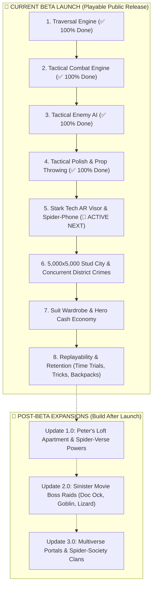

# 🕸️ Spider-Man: Web of Destiny — Master Game Architecture & Workflow

> **Vision:** An accessible, high-momentum Spider-Man sandbox combining **fluid physics traversal**, **tactile Arkham/Insomniac combat**, and **seamless multiplayer crime-fighting** across an authentic 5,000 × 5,000 stud Manhattan city.
>
> **Design Philosophy (Nintendo Rule):** *Easy to pick up, thrilling to master, zero menu clutter.* A player can pick up a controller or keyboard and feel like Spider-Man in 10 seconds.

---

## 👥 Division of Roles & Creative Partnership

| 🔨 Creator (Level Designer, Artist & Director) | 🤖 AI Lead Architect (Physics, Systems & Networking) |
| :--- | :--- |
| **5k × 5k City World:** Skyscrapers, avenues, alleys, and landmarks. | **Traversal Physics:** Harmonic pendulum swinging, wall running, slingshots. |
| **3D Models & Props:** Peter's apartment furniture, water towers, crates. | **Combat & AI Systems:** 6-move brawler engine, enemy behavior trees, ragdolls. |
| **Custom Assets:** R6/R15 animations, sound audio IDs, texture badges. | **Server Networking & Anti-Cheat:** Server authority, zero-trust economy, scaling. |
| **Creative Direction:** Game feel tuning, suit selection, boss designs. | **UI Scripting & Math:** Stark Tech AR Visor, Spider-Phone, procedural spawners. |

---

## 🗺️ Master Release Roadmap



---

# 🚀 PART 1: THE PUBLIC BETA LAUNCH (Core Gameplay Loop)

The core loop must be **instant and satisfying**:
$$\text{Swing at High Speed} \longrightarrow \text{Spot / Receive Crime Alert} \longrightarrow \text{30s High-Impact Brawl} \longrightarrow \text{Earn Cash \& XP} \longrightarrow \text{Unlock Suits in Phone}$$

---

### ✅ 1. Web-Swinging Traversal Engine (100% COMPLETED)
* [x] **Smart Building Raycast Anchors:** Raycasts scan facades up to 145 studs away with left/right hand matching.
* [x] **Double-Web Slingshot Launch:** Ground launch catapulting the player 180 studs into the air.
* [x] **Tangential Pendulum Physics:** True $\sin\theta$ gravity swoop accelerating up to 185 studs/s with `WASD` banking.
* [x] **Floaty 68° Apex Auto-Release:** Releases into smooth aerodynamic gliding with camera zoom.
* [x] **Wall-Running & Ledge Pop:** Vertical and horizontal wall sprints that pop smoothly over building copings.
* [ ] **🪂 Steep Bullet Dive-Bomb (`Left-Shift` in Air):** Tucks limbs into a steep 165+ studs/s plunge with dynamic wind rush audio and camera FOV punch, converting raw vertical gravity into an explosive forward pendulum slingshot upon latching a web line!

---

### ✅ 2. Tactical Combat Engine (100% COMPLETED)
* [x] **`Left-Click` (Melee Combo & Air Slam):** 1-2-3 Punch Combo with 7.0–8.2 stud cleave / 24-stud AoE Ground Slam.
* [x] **`Hold Left-Click` (Uppercut Launcher):** Skyward launcher with air-juggle suspension.
* [x] **`E Key` (Rapid Web-Pellets & Wall-Pinning):** 3-shot cocooning and wall-pinning matrix.
* [x] **`Q Key` (Contextual Prop Throw & Disarm):** Dual web lines swing props in a 360° overhead kinetic arc to shatter Brute shields.
* [x] **`R Key` (Web-Strike Zip Kick):** 65-stud crosshair lock-on flying dropkick at 125 studs/s.
* [x] **`F Key` (Spider-Sense Dodge):** 0.45s invulnerability frames + point-blank face-web counter.
* [x] **`T Key` (360° Web Cyclone Blender):** Continuous 10-hit AoE blender + 135 studs/s wall slam.
* [x] **`H Key` (Quick-Heal):** Instant +35 HP restore using Focus meter.

---

### 📱 3. The Stark Tech AR Visor & Dual-Panel Hero Suite
> **Design Philosophy (Psychologist & UX Lead):** Eliminate cockpit clutter and redundant radar boxes. Create a modern, relatable **Miles Morales Spider-Phone** on the left paired with a **Grand 3D Hero Showcase** on the right. Easy for an 8-year-old to navigate, but visually stunning for teenagers and streaming.

```
┌────────────────────────────────────────────────────────────────────────────────────────┐
│ [STARK OS v4.2 // SPIDER-VISOR HUD]                          [ 12:44 PM • SAT-LINK ]   │
│ ┌───────────────────────────┐      ┌─────────────────────────────────────────────────┐ │
│ │ 📱 SMARTPHONE DATAPAD     │      │ 🧬 3D HERO SUIT & AVATAR SHOWCASE               │ │
│ │                           │      │                                                 │ │
│ │ • 🚨 FNSM Crime Scanner   │      │  • Large, centered 3D character viewport        │ │
│ │ • 🥋 Hero Moves & Combos  │      │  • Smooth 360° click-and-drag rotation          │ │
│ │ • 🛍️ Suit Vault Shop      │      │  • Glowing holographic neon pedestal            │ │
│ │ • ⭐ Hero Rank & Profile  │      │  • Equipped Suit Lore & Defense Stat Badges     │ │
│ │                           │      │                                                 │ │
│ │ [🚨 REQUEST DISPATCH]     │      │  [ CURRENT: CLASSIC RED & BLUE // TIER 1 ]      │ │
│ └───────────────────────────┘      └─────────────────────────────────────────────────┘ │
│ [Press M or ESC to Return to Gameplay]                               [ $100 HERO CASH] │
└────────────────────────────────────────────────────────────────────────────────────────┘
```

* [x] **The Left-Docked Spider-Phone (`40% Width`):**
  * Opens via `M`, `Tab`, or the floating bottom-left `[📱 FNSM]` button.
  * **App 1 (🚨 FNSM Crime Scanner):** Live Manhattan police scanner, GPS waypoint tracking, and direct **`[🚨 CALL DISPATCH (YURI)]`** button so players never wait idly.
   * **App 2 (🥋 Hero Moves & Combos):** Crystal-clear Combat Codex showing all active Day 1 moves (Punch combo, Uppercut, Air Slam, Web-Yank, Pellets, Web-Strike, Dodge) + Level 2 Ultimate status. Zero fake locks!
  * **App 3 (🛍️ Suit Vault Shop):** 6 canonical suits with live Hero Cash balance, unlock level gates, and instant server-validated equip.
  * **App 4 (⭐ Hero Rank & Profile):** Player avatar portrait, live XP progress bar, total crimes stopped, and prestigious hero titles.
* [x] **The Right-Hand Grand 3D Showcase (`60% Width`):**
  * Clones the player's 3D character with their equipped suit, fabrics, and glowing emblems.
  * **Interactive 360° Drag Inspection:** Players can click & drag to admire their custom superhero from every angle.
  * Auto-rotates smoothly when idle on a glowing cyan holographic pedestal.
* [x] **Instant Seamless Gameplay Return:**
  * Pressing `M`, `Esc`, or clicking `[✕ EXIT VISOR]` instantly restores normal `WalkSpeed = 16`, disables blur, and re-engages the ShiftLock action camera for fluid web-slinging.

---

### 🏙️ 4. 5,000 × 5,000 Stud City & Concurrent District Crimes
> **Why this matters:** Spider-Man needs room to accelerate. A 5,000-stud map takes ~45s of straight flight or 2 minutes of street-winding, creating the perfect urban playground.

* [ ] **The 4 Visual Biomes (Creator Level Design Guide):**
  1. **Financial District (Canyon Sector):** Towering 400–650 stud skyscrapers spaced tightly for high-speed pendulum swoops and vertical slingshots.
  2. **Midtown / Times Square (Neon Sector):** Vibrant billboards, cross avenues, rooftop water towers, and construction cranes.
  3. **Lower Manhattan / Queens (Alley Sector):** 80–160 stud brick apartments with fire escapes, narrow alleys, and street-level brawls.
  4. **Waterfront & Central Park (Open Sector):** Open parks and river shorelines with trees and streetlamps for long-range anchor testing.
* [ ] **Multi-District Concurrent Crimes (`CrimeService.server.luau`):**
  * The server maintains **2 to 3 simultaneous crimes** in different districts (e.g. *Bank Heist in Midtown*, *Arms Deal in Financial District*).
  * 20 players on a server will never fight over 1 crime or suffer 45 seconds of empty downtime.
* [ ] **Roblox `StreamingEnabled` Optimization:**
  * Target radius set to 1,000–1,200 studs for 60 FPS performance on mobile and low-end hardware.

---

### 🛍️ 5. The "Hourglass" Progression Engine (Gamedev & Psychologist Approved)
> **The Secret to Long Playtimes:** Easy, rapid rewards in the first 10 minutes to hook players, followed by a steep, rewarding aspirational mountain that takes hours of dedication to conquer.

```
LEVEL 1-2 (First 5–10 mins)  ➔ THE TASTER: Fast early win. Unlocks Cyclone [T] & Stark Suit.
LEVEL 3-4 (30 mins – 1 hr)   ➔ THE MID-GAME: Steeper hill. Unlocks Air Slam, Stealth & Symbiote.
LEVEL 5-6+ (2 – 4+ hours)    ➔ THE PINNACLE: True dedication. Spider-Armor MK IV & 2099 Cyber Suit ($18,000).
```

* [x] **Synchronized 6-Tier Suit & Perk Ladder (Max Level 6):**
  * **Classic Suit:** Level 1 — `$0` (*Balanced baseline mobility & kinetic output*)
  * **Stark Tech Suit:** Level 2 — `$800` (*🚀 Sonic Apex Thrusters: sonic boom camera punch + boost trails*) — Achievable in ~5–7 mins.
  * **Big Time Stealth:** Level 3 — `$2,000` (*👤 Hard-Light Holographic Decoy: dodge leaves a hologram that distracts gunners*) — ~18 mins.
  * **Symbiote Black Suit:** Level 4 — `$4,500` (*🌑 Tendril Cleave & Alien Silk: brutal black webbing + AoE tendril ground slam*) — ~40 mins.
  * **Spider-Armor MK IV:** Level 5 — `$9,000` (*🛡️ Unflinching Super Armor + Reactive EMP: immunity to punch stagger*) — ~1.5 hours.
  * **2099 Cyber Suit:** Level 6 (MAX) — `$16,000` (*🤖 Singularity Cyclone: 25+ stud gravitational vortex nuke*) — **Pinnacle Trophy!**
* [x] **The 3-Pillar Combat & Progression Formula:**
  * **Pillar 1 (Base Arsenal - 100% Day 1):** Punch Combo (`L-Click`), Uppercut Launcher (`Hold L-Click`), Air Ground Slam (`Air L-Click`), Web-Yank (`Q`), Web-Pellets (`E`), Web-Strike Zip Dropkick (`R`), and Spider-Sense Dodge (`F`) are **unlocked and mastered immediately**. Zero fake level locks.
  * **Pillar 2 (Level 2 Awakening Milestone):** Reaching **Hero Level 2** officially unlocks the **360° Web Cyclone Ultimate (`T` Key)**. Level 1 teaches the brawler fundamentals; Level 2 rewards the player with their first screen-clearing nuke!
  * **Pillar 3 (In-Match Focus Meter):** Unleashing the Ultimate (`T`) requires a full 100% Focus meter, built through landing strikes, multi-hit combos, and well-timed dodges.
* [ ] **Hero Cash ($) Economic Sinks (Meaningful Progression):**
  * **1. Suit Purchases:** Hero Level grants clearance tier; Hero Cash completes the purchase.
  * **2. Stark Tech Gadget Overcharges:** Permanent combat utility upgrades (Web-Pellet Ammo 3 ➔ 5, Bio-Nanotech Quick-Heal +35 ➔ +50 HP, Seismic Ground Slam AoE expansion).
  * **3. Web Silk Chromas & Trails:** Cosmetic visual flex (Classic White, Electric Cyan `$1,500`, Crimson Laser `$3,000`, Golden Spider `$6,000`, Void Tendrils `$10,000`).
* [x] **Zero-Trust Server Authority:**
  * All XP, Levels, and Hero Cash are calculated and validated strictly on the server (`leaderstats`). No client exploitation possible.
* [ ] **Optional / Post-Launch Quality of Life: Cosmetic Transmog (Appearance Lock):** Toggle inside the Spider-Phone allowing players to lock their favorite visual suit appearance while dynamically hot-swapping gameplay perk stances.*
  * **1. Classic Red & Blue (Baseline):** Standard physics, 1.0x multipliers across all systems.
  * **2. Stark Tech Advanced (`Velocity` - 1.15x):** `GrappleController.client.luau` reads `player:GetAttribute("SuitPerkType") == "Velocity"`, scaling max swing velocity from 195 to 224 studs/s and adding cyan jet thruster trails on catapult launches.
  * **3. Stealth Big Time (`Dodge` - +0.25s):** `CombatDodge.luau` increases invulnerability frames from 0.45s to 0.70s and leaves a neon-green holographic decoy that distracts gunners.
  * **4. Symbiote Black Suit (`Damage` - 1.20x):** `CombatService.server.luau` scales melee punch/cleave damage by 1.20x, and `WebVisuals.luau` transforms web lines into viscous pitch-black alien silk (`Color3.fromRGB(20, 20, 25)`).
  * **5. Spider-Armor MK IV (`Defense` - +25 HP):** `SuitService.server.luau` adds +25 Shield additively on top of level-scaled health (175 HP max), and grants super-armor immunity against light punch flinching in `CombatMelee.luau`.
  * **6. 2099 Cyber Suit (`Acrobatic` - 1.30x):** `CombatUltimate.luau` increases `spinRadius` by 1.30x (12.35 studs) with a 25-stud gravitational vortex pulling enemies into the blender.


---

### 🏆 6. Retention, Psychology & Marketing Engines (Growth & Virality)
> **Marketing & Psychology Pillars:** What turns a 10-minute visitor into a daily active player and drives organic TikTok/YouTube clips?

* [x] **6.1 The "Dopamine Drip" & Level-Up Celebration Fanfare (Psychology & Juice):**
  * *First 60 Seconds:* High-speed web swinging at 90 studs/s with dynamic FOV swoops instantly makes the player feel like Spider-Man.
  * *First 5–7 Minutes (The Level 2 Breakthrough):* Reaching 650 XP (~3–4 crimes) triggers the **Stark OS Level-Up Celebration Fanfare**:
    1. **Sliding Stark Telemetry Banner:** An animated HUD banner slides onto screen listening to `CrimeNotification("LevelUp")`:
       * `⭐ LEVEL UP! LEVEL [X] REACHED`
       * New Title: `[ 🏙️ NEIGHBORHOOD DEFENDER ]`
       * Unlock Alert: `🌪️ UNLOCKED: 360° Web Cyclone Blender [T KEY]` + Stark Tech Suit in Wardrobe!
    2. **Tactile Screen & World Juice:** A celebratory cyan/gold radial shockwave pulse around the character + snappy camera FOV impact punch.
    3. **Audio Hook:** High-tech Stark victory chime (`VictoryFanfareId`) + radio dispatch praise.
* [ ] **6.2 High-Velocity "Clip-Ability" (Marketing & Virality):**
  * Combat features dramatic **Ragdoll Knockouts**, cinematic camera hits, and an **Arcade Style Meter** (`D` $\rightarrow$ `C` $\rightarrow$ `B` $\rightarrow$ `A` $\rightarrow$ `S` $\rightarrow$ `SPECTACULAR!`).
  * Creates highlight moments that players naturally record for TikTok, YouTube Shorts, and Discord clips.
* [ ] **6.3 Social Flexing & Status Symbols (Prestigious Titles):**
  * **Synchronized Level Titles:**
    * Level 1: *"Rookie Vigilante"*
    * Level 2: *"Neighborhood Defender"*
    * Level 3: *"Midtown Guardian"*
    * Level 4: *"Urban Avenger"*
    * Level 5: *"Protector of Manhattan"*
    * Level 6: 🌟 *"The Spectacular Spider-Man (MAX)"* (Golden chat tag & neon overhead emblem).
  * **Crimes Stopped Trophy Milestones:**
    * 10 Crimes: Bronze Medal | 25 Crimes: Silver Star | 50 Crimes: Gold Shield | 100 Crimes: Platinum Spider.
* [ ] **6.4 Universal Cross-Play Input Engine (Mobile & Console):**
  * **Mobile / Tablet:** Dynamic touch thumbstick, tap-to-swing button, and clean combat touch pads so 65%+ of Roblox players have a flawless experience.
  * **Console Gamepad (PlayStation / Xbox):** Auto-mapped native controls (`R2` Swing, `Square` Punch, `Triangle` Web Gadget, `Circle` Dodge, `L1` Prop Throw).

---

# 🌟 PART 2: FUTURE POST-BETA EXPANSIONS (Keep It Simple & Focused)

*Do NOT start these until the Beta is live and players are actively swinging!*

---

### ⚡ Update 1.0: "Peter's NYC Loft & Spider-Verse Powers"
* **🏠 Peter Parker's NYC Loft Apartment (Base of Operations):**
  * Interactive Manhattan loft: comic photo board, rest bed (+instant HP recharge), and a **window dive exit** straight into skyscraper web-swinging!
* **⚡ Simple Suit Signature Powers (1 keybind: `V` Key):**
  * **Miles:** *Mega Venom Blast* (AoE electric burst that stuns surrounding thugs).
  * **Symbiote:** *Tendril Surge* (Dark tendrils grab 4 enemies and smash them together).

---

### 🐙 Update 2.0: "The Sinister Movie Boss Raids"
* **Boss Encounters built on existing mechanics (zero bloat):**
  * **🐙 Doctor Octopus (Doc Ock):** Rooftop arena. Uses 4 mechanical tentacles. Dodge sweep attacks with `F`, web-pin tentacles to roof with `E`, then dropkick (`R`) his chest.
  * **🎃 Green Goblin (Norman Osborn):** Glider aerial dogfight. Avoid pumpkin bombs, perform In-Air Ground Slam onto glider, and hurl bombs back with `Q`.
  * **🦎 The Lizard (Dr. Curt Connors):** High-speed sewer ambush. Rapid melee combos and dense web cocooning to halt regeneration.

---

### 🌌 Update 3.0: "Multiverse Clans & Community Hub"
* **Spider-Society Central Lobby:** Social gathering space for players to display suits.
* **Co-Op Raid Portals:** Form squads of 2–4 players to tackle high-difficulty villain gauntlets.
* **Clan Leaderboards:** Most crimes stopped across global factions.

---

## 📋 Actionable Checklist: Prioritized Backlog (One Win at a Time)

* [x] **Milestone 1: 3-Pillar Combat Progression & Level 2 Ultimate** (Completed ✅).
* [x] **Milestone 2: The Level-Up Dopamine Engine** (Completed ✅).
* [x] **Milestone 3: Suit Gameplay Perks & Visual Feedback Engine** (Completed ✅).
  * Stark Tech velocity thrusters (224 studs/s), Stealth Big Time extended i-frames (0.70s), Symbiote Black 1.20x damage + black webs, Spider-Armor MK IV +25 shield, and 2099 Cyber singularity suction.
* [x] **Milestone 4: 39-Model Bespoke 3D Production Arsenal** (Completed ✅).
  * 7 complete asset categories authored via Blender 5.1 at 1:1 Roblox stud scale (Weapons, Throwables, Rooftop Ambience, Spidey Gadgets, Thug Wearables, Street Props, and Civilian Vehicles).
* [ ] **Milestone 5 (🎯 ACTIVE NEXT): Devlog #1 Voiceover & Video Release:**
  * Record 3-minute voiceover in CapCut using [Devlog_1_Script.md](file:///c:/Users/richc/Documents/Grapple/docs/Devlog_1_Script.md) with calibrated Rexus Xora-II mic.
  * Align 5 indexed gameplay clips and publish video to YouTube.
* [ ] **Milestone 6: Steep Bullet Dive-Bomb (`Left-Shift` in Air):**
  * Tucks limbs into a 165+ studs/s plunge, converting vertical drop into explosive forward swing momentum.
* [ ] **Milestone 7: 5,000 × 5,000 Stud Manhattan City & Concurrent District Crimes:**
  * Dress alleyways and avenues using the 39-model asset library.
  * Wire dynamic concurrent crimes across 4 distinct visual biomes (Financial, Midtown, Queens/Alley, Waterfront).


